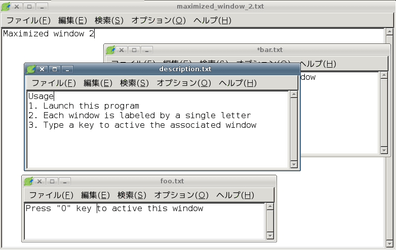

Window Switcher
===============
Change the active window gracefully from the keyboard.

Usage
-------
1. Launch this program
2. Each window is labeled by a single letter
3. Type a key to active the associated window

Environment
------------
PyGTK

Acknowledgment
---------------
The idea of this interface is due to [Mouseless Browsing](https://addons.mozilla.org/ja/firefox/addon/mouseless-browsing/). Althogh this software has nothing to do with Mouseless Browsing, I would like to thank the great software here.
